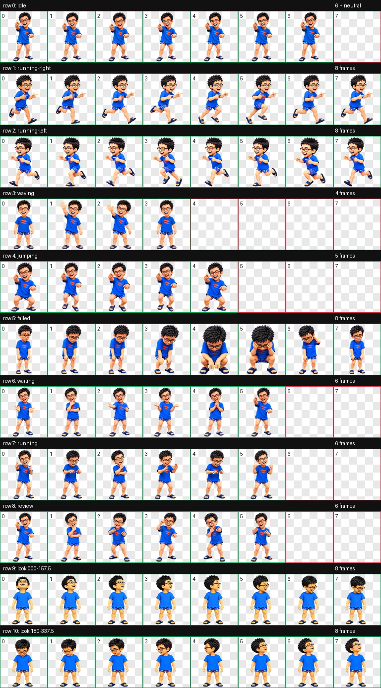

# Cyber Shu

Cyber Shu 是一个可用于 Codex 桌面端的自定义动态宠物：蓝色 T 恤、黑框眼镜，带有待机、奔跑、挥手、跳跃、等待、失败和代码审查等动画。



## 快速安装

### macOS / Linux

克隆仓库后运行：

```bash
git clone git@github.com:Waldeinsamkeit123/Cyber_Shu.git
cd Cyber_Shu
./install.sh
```

安装完成后，打开或重启 Codex，在 **Mini / 宠物设置** 中选择 **Cyber Shu**。不同版本的 Codex 中入口名称可能略有不同。

### 手动安装

1. 在 Codex 配置目录下创建宠物文件夹：

   ```bash
   mkdir -p "${CODEX_HOME:-$HOME/.codex}/pets/cyber-shu"
   ```

2. 复制宠物配置和精灵图：

   ```bash
   cp pet/pet.json pet/spritesheet.webp \
     "${CODEX_HOME:-$HOME/.codex}/pets/cyber-shu/"
   ```

3. 打开或重启 Codex，然后选择 **Cyber Shu**。

## 动画预览

| 状态 | 预览 |
| --- | --- |
| 待机 |  |
| 向右奔跑 |  |
| 向左奔跑 |  |
| 挥手 |  |
| 跳跃 |  |
| 等待 |  |
| 执行中 |  |
| 失败 |  |
| 代码审查 |  |

## 项目结构

```text
Cyber_Shu/
├── pet/
│   ├── pet.json          # Codex 宠物配置
│   └── spritesheet.webp  # 可直接使用的 v2 精灵图
├── preview/              # 动画 GIF 与总览图
├── qa/                   # 尺寸、透明度和动作验证结果
├── source/
│   └── avatar.png        # 风格化角色原画（不包含原始真人照片）
├── install.sh            # macOS / Linux 安装脚本
└── README.md
```

## 技术规格

- Codex 宠物格式：`spriteVersionNumber: 2`
- 精灵图尺寸：`1536 × 2288`
- 网格：`8 列 × 11 行`
- 单帧尺寸：`192 × 208`
- 标准动画：9 组
- 注视方向：16 个方向
- 图像格式：带透明通道的 WebP

最终精灵图已通过结构、透明度、色键残留和动画完整性检查，详见 [`qa/`](qa/)。

## 自定义名称或说明

可以修改 [`pet/pet.json`](pet/pet.json) 中的 `displayName` 和 `description`。请不要修改 `spriteVersionNumber`、精灵图尺寸或网格布局，否则 Codex 可能无法正确播放动画。

## 卸载

删除安装目录即可：

```bash
rm -rf "${CODEX_HOME:-$HOME/.codex}/pets/cyber-shu"
```

删除前请确认路径完整且确实指向 `cyber-shu` 宠物目录。

## 隐私说明

角色造型来自私人视觉参考的风格化创作。本仓库仅包含生成后的宠物素材，不包含原始真人照片。

